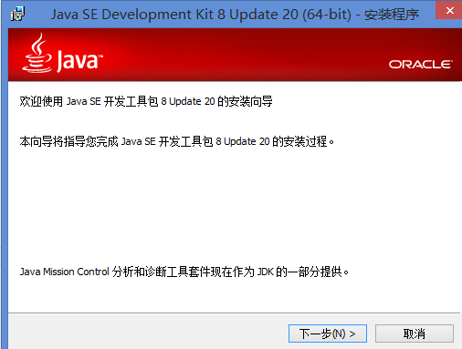
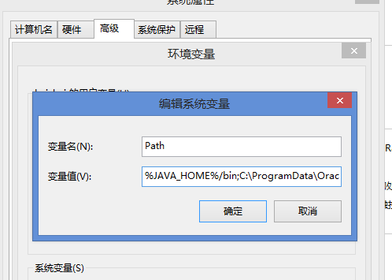
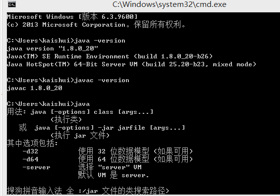
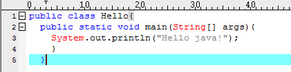
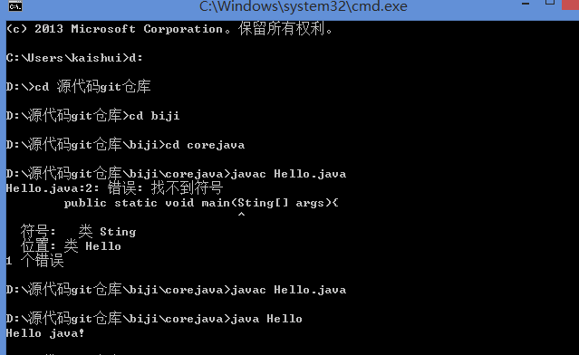

###java 开发环境配置
***

1._下载JDK_

   最新的JDK下载地址为: [点我下载][1]

2._安装JDK_

双击安装  
+ 配置JAVA_HOME：
	- 我的电脑->属性->高级系统设置->高级->环境变量  新建JAVA_HOME=C:\Program Files\Java\jdk1.8.0_20
    
	- 配置path

1.	检查配置是否正确 cmd窗口下输入 java -version和 javac -version

2.Hello.java

这样JDK的开发环境在本地成功配置完成

[1]:http://www.liangchan.net/liangchan/1518.html
